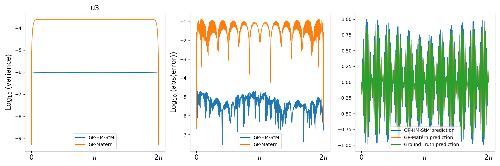
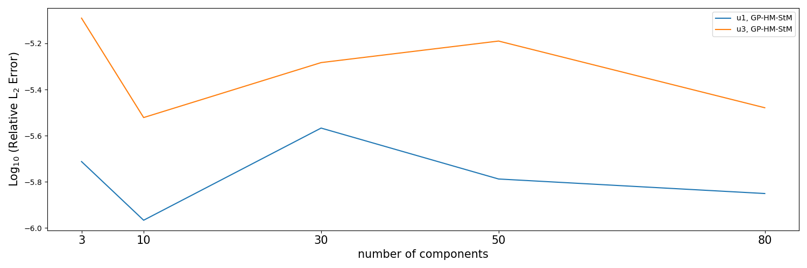

# Solving-High-Frequency-and-Multi-Scale-PDEs-with-Gaussian-Processes

## Figure for variance, error, and prediction

$u_1=sin(100x)$:

$u_3=sin(6x)cos(100x)$:

## Figure for relative L2 error with varying number of frequency components

